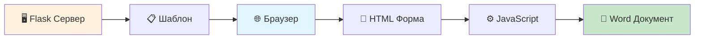

# 🎓 Генератор заявки на научный проект

<div align="center">

**Безопасное веб-приложение для автоматического создания документов заявок на научные проекты**

*Все данные обрабатываются локально в браузере - максимальная конфиденциальность гарантирована*


</div>

## 🔒 Безопасность превыше всего

| 🛡️ Особенность | 📋 Описание |
|---|---|
| **100% Конфиденциальность** | Все данные обрабатываются только в вашем браузере |
| **Нет передачи данных** | Заполненные данные никогда не покидают ваш компьютер |
| **Локальное кэширование** | Шаблон сохраняется в браузере после первой загрузки |
| **Офлайн работа** | Работает без интернета после начальной загрузки |

## 🚀 Быстрый старт

### 📋 Требования
- 🐍 Python 3.7+
- 📦 pip
- 🌐 Современный браузер

### ⚡ Установка за 3 шага

```bash
# 1️⃣ Установите зависимости
pip install -r requirements.txt

# 2️⃣ Запустите приложение
python app.py

# 3️⃣ Откройте в браузере
# http://localhost:5000
```

> 💡 **Совет:** После первого запуска приложение будет работать офлайн!

## 📝 Использование

<div align="center">

### 🎯 Простой процесс из 4 шагов

</div>

| Шаг | Действие | Описание |
|:---:|---|---|
| **1️⃣** | **Откройте приложение** | Шаблон автоматически загрузится в браузер |
| **2️⃣** | **Заполните форму** | ✅ Основная информация<br>📊 КПЭ и бюджет<br>👥 Команда проекта<br>💰 Детальная смета |
| **3️⃣** | **Нажмите "Создать документ"** | Документ создается локально в браузере |
| **4️⃣** | **Получите готовый файл** | `Заявка_название_проекта.docx` скачается автоматически |

### 🧪 Тестирование
> **Кнопка "Тестовые данные"** - автоматически заполняет все поля примерами для быстрой проверки

## 🏗️ Архитектура

<div align="center">



**Клиент делает всё** • **Сервер только раздаёт файлы**

</div>

## 🛠️ Технологии

<table>
<tr>
<td width="50%">

### 🖥️ Backend (минимальный)
- 🐍 **Python Flask** - раздача файлов
- 📄 **Word шаблоны** - основа документов

</td>
<td width="50%">

### 🌐 Frontend (основная логика)  
- 📝 **HTML5/CSS3** - современный интерфейс
- ⚙️ **JavaScript ES6+** - обработка форм
- 📋 **docxtemplater** - генерация документов
- 💾 **LocalStorage** - кэширование

</td>
</tr>
</table>

## ✨ Ключевые особенности

<div align="center">

| 🔐 Безопасность | ⚡ Производительность | 🎨 Удобство |
|:---:|:---:|:---:|
| 100% локальная обработка | Мгновенная работа офлайн | Адаптивный дизайн |
| Нет передачи данных | Кэширование в браузере | Умная валидация |
| Полная конфиденциальность | Индикаторы прогресса | Автоматические расчеты |

</div>

### 🎯 Что умеет приложение

- 📝 **Полные формы заявок** - поддержка всех типов документов (Формы 1-4)
- 📊 **КПЭ и бюджетирование** - автоматический расчет показателей эффективности  
- 👥 **Управление командой** - динамическое добавление участников проекта
- 💰 **Детальная смета** - расшифровка затрат по категориям с итогами
- 📅 **Календарь и форматирование** - автоматическое форматирование дат
- 📱 **Мобильная версия** - работает на всех устройствах
- 🧪 **Режим тестирования** - быстрая проверка с демо-данными

---

<div align="center">

### 🚀 Готов к использованию прямо сейчас!

**Требуется только Python и браузер** • **Установка за 1 минуту** • **100% бесплатно**

---

*Создано для упрощения подачи заявок на научные проекты*

</div>
